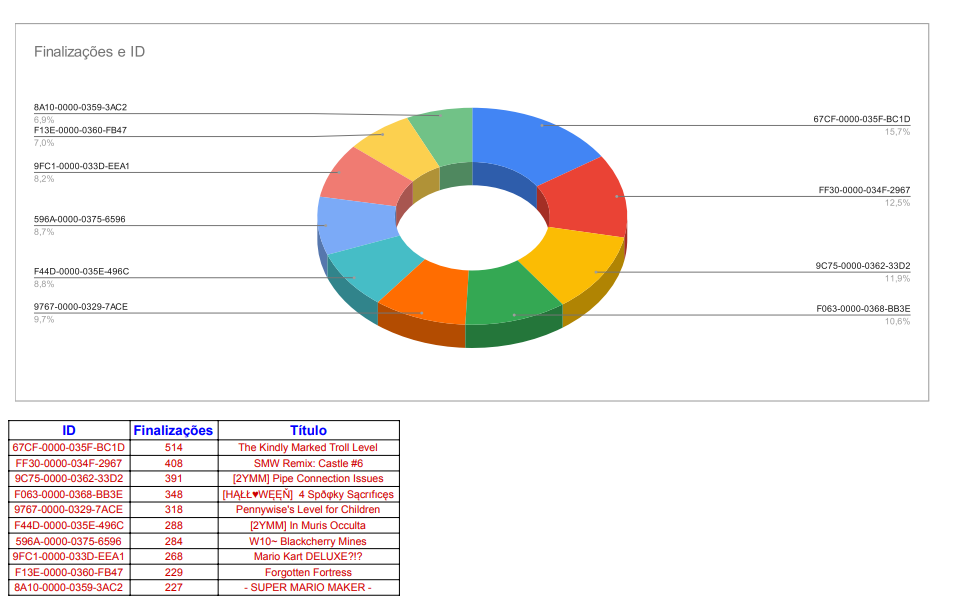
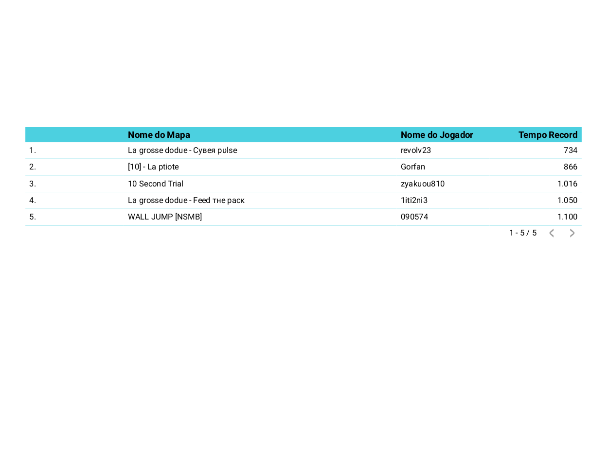
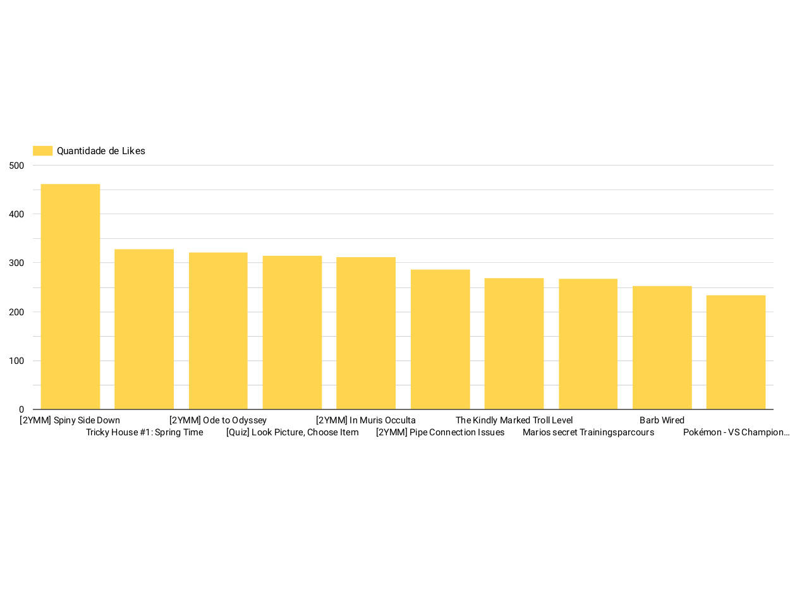
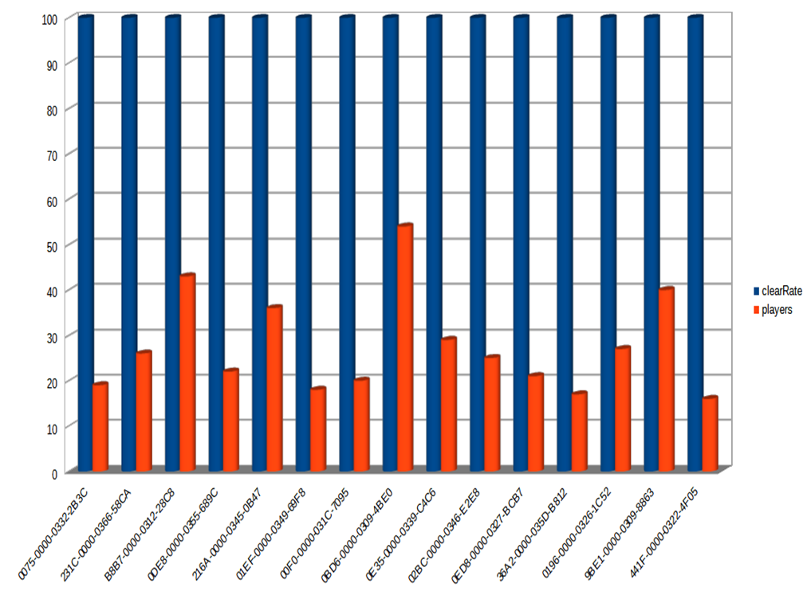

<h1>Projeto Módulo 3</h1>

Um projeto de final de módulo para a <a href="https://www.linkedin.com/school/resilia-educacao/">@Resilia</a>, do qual tinha a premissa de exercitar e consolidar nossos conhecimentos em banco de dados relacionais (SQL), além de uma breve mergulho no tópico de Análise de Dados.

Nos foi passado um briefing do qual pedia para analisar o <a href="https://www.kaggle.com/leomauro/smmnet">Dataset Temporal do Super Mario Maker</a> e criar dashboards com as informações que conseguimos extrair.

<h2>Participantes</h2>
<ul>
  <li><a href="https://www.linkedin.com/in/filipe-martins-2502bb223">Filipe Martins</a></li>
  <li><a href="https://www.linkedin.com/in/pedro-santos-593824224">Pedro Santos</a></li>
  <li><a href="https://www.linkedin.com/in/flppaesdemelo/">Felipe Paes</a></li>
  <li><a href="https://www.linkedin.com/in/diego-fernandes-chagas/">Diego Fernandes</a></li>
</ul>

<h2>  Dashboards utilizadas </h2>

<h2>  Link para apresentaçao </h2>

<a href="https://www.canva.com/design/DAE30UmzNnI/gIacbHb4pZ6vZoafhfwoBQ/view?utm_content=DAE30UmzNnI&utm_campaign=designshare&utm_medium=link&utm_source=publishsharelink"></a
